# Open Data and Public APIs workshop

## Workshop description
This workshop introduces the students how to access publicly available near-real-time & historic data sources and teaches the students basic data visualizing in Rhino Grasshopper.
The students will be introduced to concepts & technologies such as distributed systems and REST APIs. Through a series of beginner-level Grasshopper tutorials, the students will work with historic and near-real-time data and be asked to think about how and when to use these kind of data source. 

## Workshop keywords
- Publicly available real-time and historic data
- The modern web & REST APIs
- Data driven design (quantitively vs qualitatively design decision making)
- Parametric modelling and data visualization in Grasshopper
- Responsive and adaptive design

## Required software & Signups
### RhinoGrashopper plugins 
- PublicAPI.gha from the /plugin/ folder
- [JSwan](https://www.food4rhino.com/app/jswan) 
- [Human](https://www.food4rhino.com/app/human)
- [Elk](https://www.food4rhino.com/app/elk) - version 2.2.2 

### Signups
- [AQIcn token](https://aqicn.org/data-platform/token/#/)

### Check that you are all set...
Prior to the workshop, please check that you are all set by running the Grasshopper file called "0-1_checks.gh" found in /gh/ folder. You will need to add your AQIcn token to the textbox that says "Add IAQcn token here".
The script should look something like this:
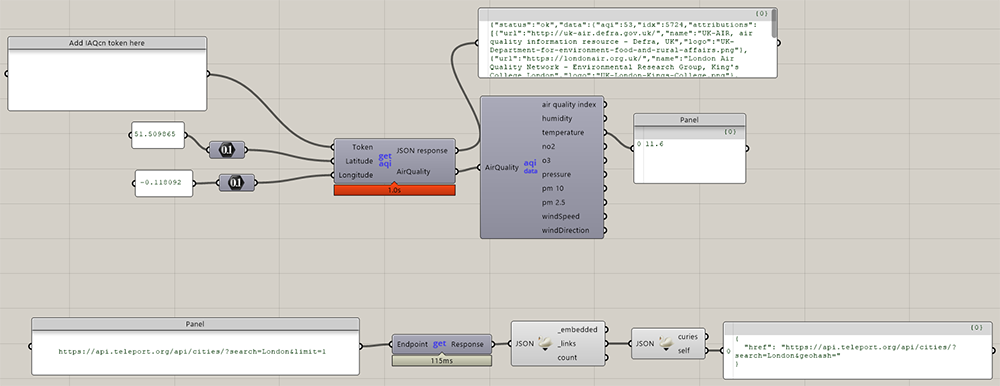

## Data types & APIs used in this workshop

|Category  |Data Types  |Endpoint  |Comment  |
|---------|---------|---------|---------|
|Air Quality     | Temp, hum, wind, pollutants         | aqicn.org        |  Token required      |
|Air Quality     | Temp, hum, wind, pollutants         | openaq.org       |  Open, but slower      |
|Weather     | Temp, hum, wind, pollutants         | openweathermap.org       | Token required     |
|Water     |   Flood warnings, water levels      | [environment.data.gov.uk](http://environment.data.gov.uk/flood-monitoring/doc/reference)        |    Open     |
|Cultural     |    Quality of Life     |  [Teleport.org](https://developers.teleport.org/)       |    Open     |

List of additional APIs https://github.com/public-apis/public-apis

## Tutorial overview
1.	Visualizing data
    1.	Visualizing data points				
    2.	Creating parametric diagrams 
    3.	Interpolating data

2.	Designing based on historic data	
    1. Visualizing data over time
    2. Evaluating design options based on performance criteria

3.	Responsive design
    1.	Connecting a parameteric model to data from API

## Tutorials
### 1.	Visualizing data
### 1.1 Visualizing data points	
In this tutorial we will display the current environmental information for given locations on a textured sphere.

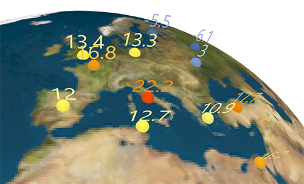

#### Steps
- Introduction to AQIcn
- Get lat + lon for London with Google & GET temperature from endpoint
- Display data on sphere. Texture map base on https://en.wikipedia.org/wiki/Equirectangular_projection
- Getting lat + lon from API

#### Key components and concepts
- Public API plugin: AQIcn
- Rhino: Texture mapping
- GH: Map component
- GH: Evaluating a surface
- GH: Planes
- Public API plugin: Get Request
- GH: Joining text
- Public API plugin: Chaining requests.

### 1.2 Creating parametric diagrams
In this tutorial we create a parametric diagram based on the Quality of Life API from Teleport.org

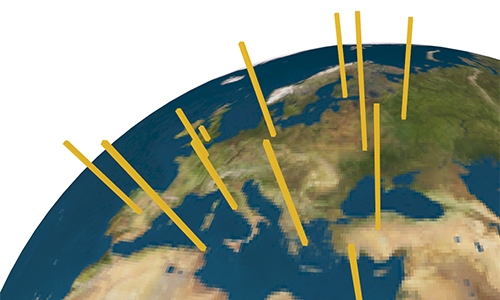
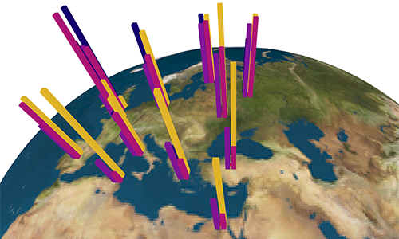
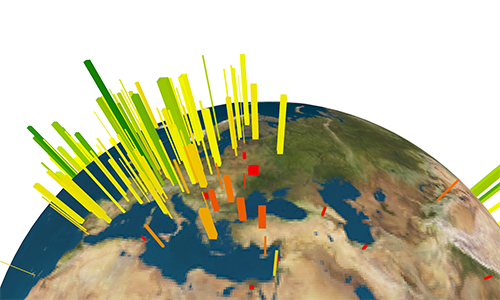
#### Steps
- Continue previous exercise
- Get data from Teleport.org
- Display multiple datatypes next to each other as columns
#### Key components and concepts
- Reading API docs
- Public API plugin: Chaining requests.
- GH: Map component
- GH: Planes

### 1.3 Interpolating data
In this tutorial we create a "heatmap" by interpolating environmental data from AQIcn
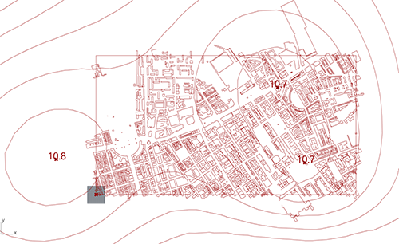
#### Steps
- Set Rhino model units to meter.
- Download OSM file from OpenStreetMap (and screenshot)
- Import OSM data with ELK
- Get lat/long from OSM
- Convert lat/long to Rhino metric units (and the other way)
- Gett data from AQIcn
- Remap temperature data to greyscale color values
- Color mesh with Mesh Spray
- Update mesh vertices with height info from color
- Countour mesh
#### Key components and concepts
- ELK plugin
- Adding background bitmap in Rhino
- GH: Map component
- GH: Color as heightmap
- GH: Mesh & Spray Mesh
- Gh: Contour

### 2. Designing based on historic data	
### 2.1 Visualizing data over time
In this tutorial we will model an object in the river Thames. Based on UK GOV floodmonitoring API we will get water levels for a given date from a station near the Tower Bridge. We will visualize the flood levels on our object and manually design it to create different spatial experiences based on the flood levels.

The object is inspired by an [Junya Ishigami project](https://www.dezeen.com/2014/07/21/junya-ishigami-svendborg-architects-copenhagen-harbour-peace-symbol-cloud/).

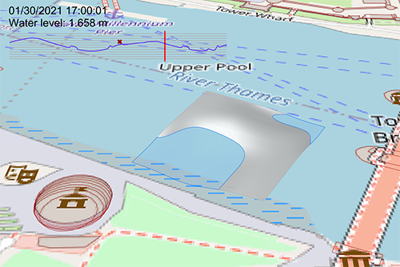
#### Steps
- Set Rhino model units to meter.
- Download OSM file from OpenStreetMap (and screenshot)
- Import OSM data with ELK
- Get lat/long from OSM
- Convert lat/long to Rhino metric units (and the other way)
- Get flood station from environment.data.gov.uk
- Get flood levels for a given day for a given station from environment.data.gov.uk
- Intersect our object with the flood level
- Draw graph in Rhino
- Display graph and information on viewport with Human UI
#### Key components and concepts
- ELK plugin
- Adding background bitmap in Rhino
- Public API plugin: GET from environment.data.gov.uk
- Public API plugin: Chaining requests
- Human plugin - drawing to the UI
- GH: Solid/Brep intersetions

### Evaluating design options based on performance criteria
This is a continuation of the previous exercise. This time we will look 4 weeks worth of flood level data and evaluate our design based on that.

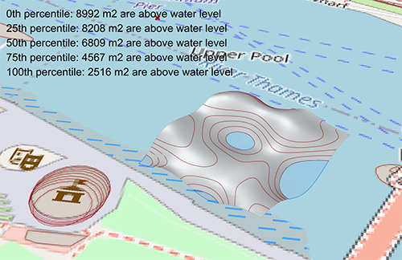

#### Steps
- Continue previous model
- Get 4 weeks worth of flood level data. Store it as json file.
- Load locale json file.
- Calculate 0th, 25th, 50th, 75th and 100th percentile of flood levels.
- Display flood levels on screen
- Intersect object with multiple flood levels

#### Key components and concepts
- Percentiles
- Comparing models
- GH: Loading local files.

### 3. Responsive design
### 3.1	Connecting a parameteric model to data from API
In this exercise we will create a paramertic model that is responsing to the food levels.

We will model a 2d grid of floating boxes with varying heights. Based on the flood level, the boxes will either float or sit on the river bed.

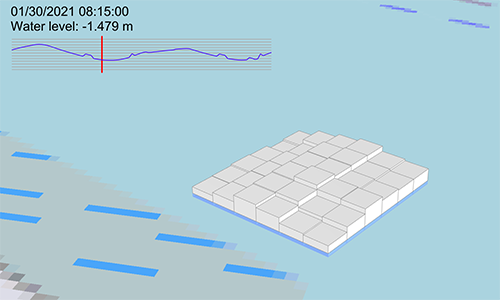
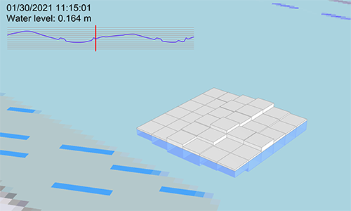
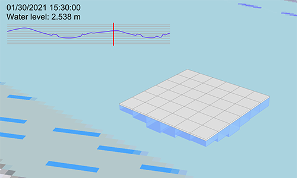

#### Steps
- Continue previous model. Reuse graph, flood level data (1 day) and osm model.
- Model element height reference surface and river bed level surface
- Generate bed level planes and rectangles
- Calculate heights and extrude boxes
- Intersect with water level
- Move box to water level if box is lower than water level
- Split boxes based on water for visualization purposes

#### Key components and concepts
- Move points based on vectors
- Conditionals
- GH: Solid/Brep intersetions
- Getting the center of a box
